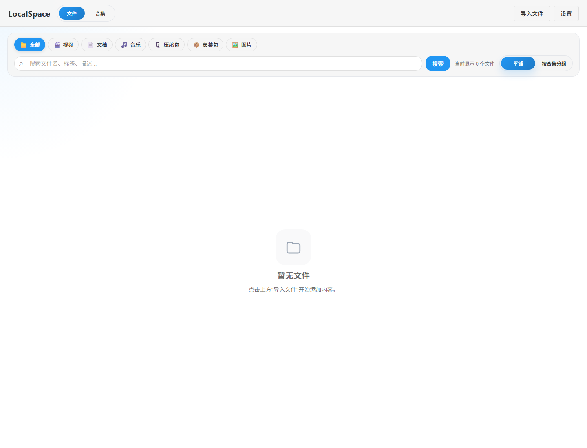
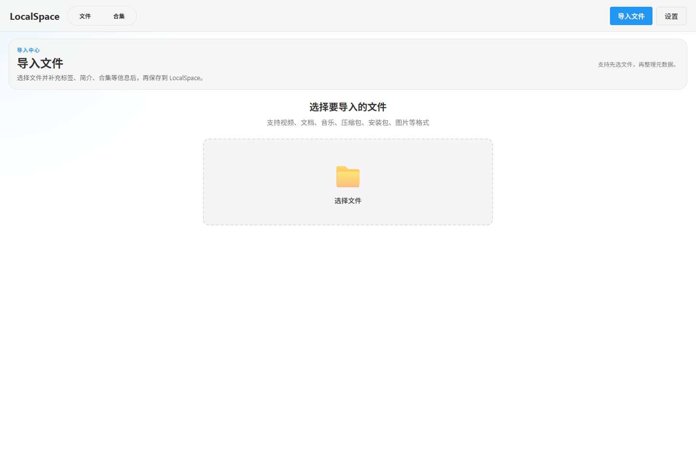
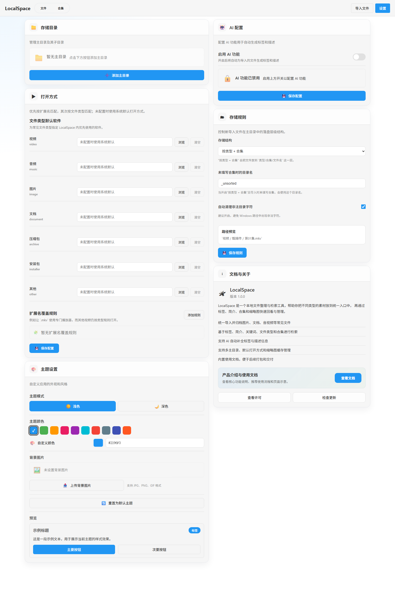

# LocalSpace

LocalSpace 是一款面向个人资料库和项目素材库的桌面应用，核心定位是“本地文件管理 + AI 辅助整理”。

它不是单纯的文件选择器，而是把本地文件导入、归档、检索、打开和持续整理串成一条完整链路：你可以把图片、文档、音视频、压缩包、安装包等资料统一收进一个入口，再通过标签、描述、关键词、合集和文件类型快速找到它们；如果配置了 AI，还可以在导入时辅助生成标签与描述，降低整理成本。

## 软件基本介绍

- 本地优先：文件由本地桌面应用管理，适合构建个人资料库、学习资料库、项目素材库。
- 统一入口：将不同类型文件收敛到同一个界面中管理，不再分散在多个文件夹中来回查找。
- AI 辅助：支持在导入阶段生成标签与描述，帮助提升后续搜索命中率和资料可读性。
- 可持续整理：除了导入和搜索，还提供存储目录、打开方式、存储规则、主题与内置文档等配置能力。

## 功能说明

### 1. 文件展示

文件页是日常使用的主入口，负责集中展示已导入资料。

- 支持按全部、视频、文档、音乐、压缩包、安装包、图片等类型切换查看。
- 支持按文件名、标签、描述等关键词进行搜索。
- 支持文件缩略图、元信息和状态展示，便于快速回看内容。
- 支持从列表中直接打开文件，并结合设置中的“打开方式”配置提升访问效率。

上图对应当前主界面：顶部是“导入文件”和“设置”入口，中间是文件类型筛选与搜索框，下面是文件列表区域。即使在尚未导入文件时，也能直观看到软件的核心操作路径。

### 2. 文件导入

导入页负责把本地文件正式纳入 LocalSpace 的资料库结构中。

- 先选择本地文件，再进入元数据补充流程。
- 可填写名称、标签、关键词、描述、合集等信息。
- 系统会识别文件类型，用于后续分类展示与存储归档。
- 配置 AI 后，可在导入流程中生成标签和描述建议，再决定是否采用。

上图展示的是导入入口页。用户通常会先在这里选择文件，然后进入下一步完善元数据。AI 相关能力也主要在这一阶段发挥作用，因此如果想让资料后续“更容易搜到”，最值得花时间的就是这里。

### 3. 设置

设置页负责完成软件初始化和长期使用中的关键配置，当前主要包括以下几个维度：

- 存储目录：配置主目录、默认目录，以及本地资料的落盘位置。
- 打开方式：按文件类型或扩展名指定默认打开程序，减少在系统资源管理器里反复切换。
- AI 配置：填写 API Key、模型名、Base URL 等参数，启用标签与描述自动补全。
- 存储规则：控制新导入文件如何按类型或“类型 + 合集”落盘。
- 主题设置：调整主题模式、主色和背景图。
- 文档与关于：在软件内直接查看产品说明文档。

从截图可以看到，设置页已经把“存储目录 / 打开方式 / AI 配置 / 存储规则 / 主题设置 / 文档与关于”集中到一个位置，适合作为首次上手的初始化入口。

## 用户指南

建议用户拿到软件后，按下面顺序开始使用：

1. 先打开“设置”，配置主存储目录。
2. 如果你希望文件按更清晰的层级归档，再补充“打开方式”和“存储规则”。
3. 如果需要 AI 辅助，在“AI 配置”中填写模型信息并启用功能。
4. 进入“导入文件”，选择本地文件，补充标签、关键词、描述和合集。
5. 在导入表单中按需使用 AI 生成功能，确认内容合适后再执行导入。
6. 回到文件页，通过类型筛选和搜索框检查导入结果，并直接打开文件使用。
7. 如果需要交付给其他人使用，可以让对方从“设置 -> 文档与关于 -> 查看文档”进入内置说明页。

### 推荐使用方式

- 首次使用时，优先把存储目录配置稳定，避免后期频繁迁移。
- 标签、关键词和描述尽量统一命名规则，这会直接影响搜索效果。
- AI 建议先用少量文件试跑，确认生成风格符合预期后再扩大使用范围。
- 如果资料较多，建议把“合集”作为一层轻量分组，用来区分项目、课程、专题或来源。

## 后续计划

以下内容基于 [docs/2026-07-19-localspace-产品审查与功能建议.md](./docs/2026-07-19-localspace-%E4%BA%A7%E5%93%81%E5%AE%A1%E6%9F%A5%E4%B8%8E%E5%8A%9F%E8%83%BD%E5%BB%BA%E8%AE%AE.md) 做了粗粒度整理，更适合作为产品路线图阅读：

### 优先级最高

1. 批量导入与导入队列
   支持一次选择多个文件、批量套用公共字段、查看导入进度、失败重试与跳过重复项。
2. 目录扫描 / 监听导入
   先支持手动扫描目录进入待导入列表，后续再扩展为自动监听新增文件。
3. 重复文件中心
   将已有的重复检测能力前置，提供跳过、保留两份、替换元数据、打开已有项和集中清理入口。
4. 整理工作台
   在文件列表之上补足批量选中、批量改标签与描述、待整理视图、最近导入与最近修改等能力。

### 第二层增强

- 高级搜索：标签、日期范围、文件大小、文件子类型、排序与保存搜索条件。
- 资料合集 / 收藏夹：面向项目、主题、学习内容建立稳定入口。
- 导入规则模板：针对不同目录预设默认标签、目标主目录和 AI 开关。
- 元数据质量面板：发现缺描述、缺标签、命名不统一、长期未整理的资料。

### AI 方向

- 为 AI 建议附带简单理由，提升可理解性。
- 支持仅补标签、仅补描述、一键重生成等更细粒度操作。
- 引入低置信度提示，减少错误内容污染资料库。

整体上，LocalSpace 后续会继续围绕三件事打磨：导入效率、整理效率、去重可信度。
