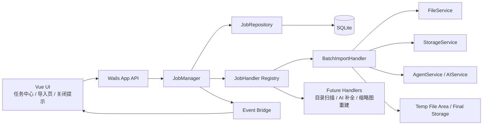
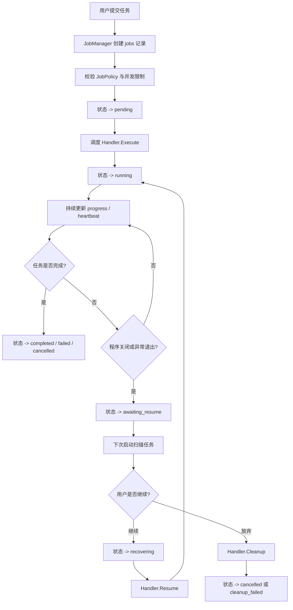
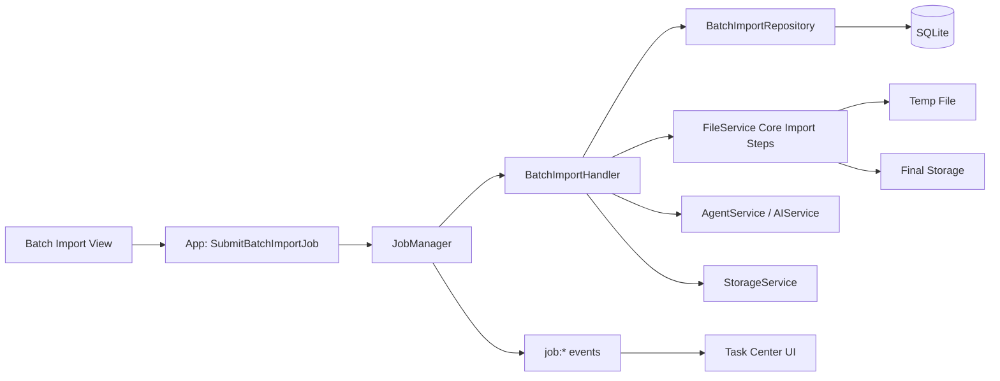
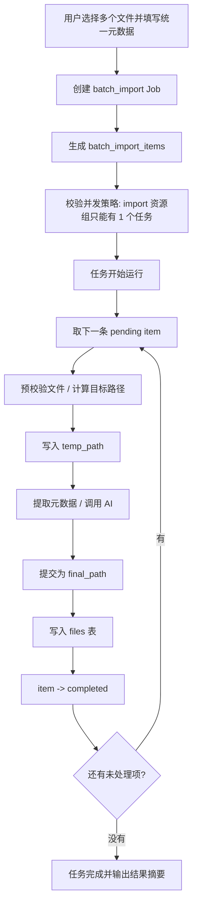
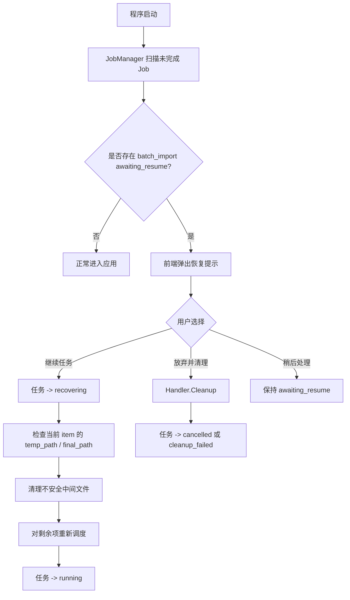

# LocalSpace 通用任务系统与批量导入设计

日期：2026-07-20

## 背景

当前 LocalSpace 的导入链路以单文件为中心：

- 导入页一次只处理一个文件
- 前端进度状态只存在于当前页面组件内
- 后端导入逻辑以同步单次调用为主
- 程序关闭、重启恢复、后台继续执行、超时清理都没有统一机制

这在“批量导入”场景下会直接暴露几个问题：

1. 用户一次选择多个文件时，缺少统一进度和失败反馈
2. 用户离开导入页后，任务状态无法稳定持续展示
3. 程序关闭时无法判断是否存在需要保护的长任务
4. 下次启动时无法识别和恢复未完成任务
5. 大文件中断后，可能留下半成品文件或脏状态

同时，批量导入并不是唯一可能的后台任务。后续很可能还会出现：

- 目录扫描导入
- AI 批量补全元数据
- 缩略图重建
- 重复文件扫描
- 库一致性修复

因此，本设计不把“批量导入”单独做成一次性特例，而是先设计一套通用 Job 系统，再让批量导入成为第一个高要求 JobType。

## 文档范围

本文包含两部分：

1. 通用任务系统设计
2. 批量导入设计

本文重点覆盖我们已确认的需求点：

- 任务可展示进度条
- 任务可切到后台继续运行
- 同一时间只能有 1 个批量导入任务
- 关闭程序时若有后台批量任务，需要给出提示
- 下次打开时，需要提示用户是否继续未完成批量任务
- 批量任务超时或异常中断后，需要清理损坏文件和临时文件
- 任务系统本身应当通用、可扩展，不只服务于批量导入

## 目标

### 产品目标

- 为用户提供稳定、可感知、可恢复的后台任务体验
- 将“批量导入”从单页表单行为升级为“系统级任务”
- 为未来其他长任务提供统一承载层

### 工程目标

- 统一任务生命周期、状态机、并发控制、恢复机制
- 将任务调度与具体业务处理解耦
- 保证批量导入在异常中断后具备可恢复或可清理能力

## 非目标

本文不包含以下内容：

- 首版不做多任务并行执行调优
- 首版不做跨设备任务同步
- 首版不做任务优先级抢占
- 首版不做复杂的任务依赖编排
- 首版不做任意任务类型的可视化 DAG 编辑器

---

## 第一部分：任务系统

## 1. 设计原则

### 1.1 通用优先

任务系统先抽象“任务”，再落地“批量导入”。不要反过来先做一个只适配导入页的导入队列。

### 1.2 状态持久化优先

只依赖内存中的 goroutine 不足以支撑关闭保护、重启恢复和超时清理。任务主状态必须持久化。

### 1.3 调度与执行解耦

JobManager 负责任务生命周期和调度；具体业务由 JobHandler 实现。

### 1.4 失败可恢复，恢复不可盲目

恢复不是“继续旧线程”，而是“基于持久化状态重新调度剩余工作”。

### 1.5 明确资源边界

“批量导入同一时间只能有 1 个”是某个 JobType 的并发策略，不应变成整个任务系统的全局死规则。

## 2. 总体架构



## 3. 分层职责

### 3.1 App / Wails API 层

职责：

- 暴露任务相关接口给前端
- 在启动、关闭前后挂接任务系统
- 通过事件将任务进度推送给前端

建议新增能力：

- `OnBeforeClose` 拦截关闭行为
- `OnStartup` 时执行未完成任务扫描
- `OnShutdown` 时安全落盘内存态

### 3.2 JobManager

职责：

- 创建任务
- 启动任务
- 查询当前活动任务
- 取消任务
- 恢复任务
- 处理心跳与超时
- 校验并发策略
- 在启动时扫描可恢复任务

不负责：

- 不直接理解“如何导入一个视频”
- 不直接处理批量导入文件清理细节

### 3.3 JobHandler

每种任务类型独立实现一个 Handler。

职责：

- 校验输入 payload
- 执行业务逻辑
- 上报进度
- 实现恢复逻辑
- 实现清理逻辑

### 3.4 Repository / 持久化层

职责：

- 保存任务主表
- 保存任务明细表
- 记录状态变化时间
- 支撑启动恢复和历史查询

## 4. 核心模型

## 4.1 Job 主模型

建议新增 `jobs` 主表，对应 `models.Job`。

建议字段：

- `id`
- `job_type`
- `status`
- `title`
- `payload`
- `result`
- `progress_total`
- `progress_completed`
- `progress_message`
- `exclusive_key`
- `can_resume`
- `started_at`
- `heartbeat_at`
- `finished_at`
- `timeout_at`
- `error_message`
- `created_at`
- `updated_at`

字段说明：

- `payload`：任务输入，JSON 序列化
- `result`：任务结果摘要，JSON 序列化
- `exclusive_key`：并发资源组，例如 `import`
- `can_resume`：该类型任务是否支持恢复
- `heartbeat_at`：最近一次活动时间，用于超时判断

## 4.2 JobType

建议使用字符串枚举：

- `batch_import`
- `directory_scan`
- `ai_metadata_fill`
- `thumbnail_rebuild`

## 4.3 JobStatus

建议使用统一状态机：

- `pending`
- `running`
- `paused`
- `awaiting_resume`
- `completed`
- `failed`
- `cancelled`
- `timed_out`
- `recovering`
- `cleanup_failed`

说明：

- `awaiting_resume`：任务因用户关闭程序或异常退出而停止，但具备恢复条件
- `recovering`：正在执行恢复准备，例如校验临时文件、清理中间状态
- `cleanup_failed`：主要用于提示需要用户介入的残留问题

## 4.4 JobPolicy

每个 JobType 应配置策略，而不是写死在 JobManager 中。

建议模型：

```go
type JobPolicy struct {
    JobType          string
    MaxConcurrent    int
    ExclusiveKey     string
    CanRunBackground bool
    Recoverable      bool
    Timeout          time.Duration
}
```

示例：

- `batch_import`
  - `MaxConcurrent = 1`
  - `ExclusiveKey = "import"`
  - `Recoverable = true`
  - `CanRunBackground = true`
- `thumbnail_rebuild`
  - `MaxConcurrent = 1`
  - `ExclusiveKey = "thumbnail"`
- `ai_metadata_fill`
  - `MaxConcurrent = 2`
  - `ExclusiveKey = ""`

## 5. 接口设计

## 5.1 JobHandler 接口

建议：

```go
type JobHandler interface {
    Type() string
    Validate(payload json.RawMessage) error
    Execute(ctx context.Context, job *models.Job, runtime JobRuntime) error
    Resume(ctx context.Context, job *models.Job, runtime JobRuntime) error
    Cleanup(ctx context.Context, job *models.Job, runtime JobRuntime) error
}
```

其中 `JobRuntime` 可封装：

- 进度上报
- 心跳更新
- 状态更新
- 结果写入
- 日志记录
- 获取仓储与服务依赖

## 5.2 App 层对前端暴露的通用接口

建议：

- `CreateJob(req)`
- `StartJob(jobID)`
- `GetActiveJobs()`
- `GetJob(jobID)`
- `ListJobs(page, pageSize, jobType)`
- `CancelJob(jobID)`
- `ResumeJob(jobID)`
- `DismissResumableJob(jobID)`

对首版也可简化为：

- `SubmitBatchImportJob(req)`
- `GetActiveJob()`
- `GetResumableJobs()`
- `CancelJob(jobID)`
- `ResumeJob(jobID)`

## 6. 事件与前端同步

任务运行时，前端不应依赖页面轮询单一组件状态。

建议提供两种机制：

1. 启动时主动查询
2. 运行中通过事件推送

建议事件：

- `job:created`
- `job:updated`
- `job:completed`
- `job:failed`
- `job:needs-resume`

前端消费后可实现：

- 全局任务入口显示
- 导入页进度条同步
- 非导入页后台任务卡片
- 启动恢复提示弹窗

## 7. 关闭保护与恢复机制

## 7.1 关闭保护

当存在 `running` 状态、且 `CanRunBackground = true` 的关键任务时：

- `OnBeforeClose` 拦截关闭
- 若当前存在批量导入任务，则提示用户

建议文案：

“当前有 1 个批量导入任务正在后台运行，关闭程序可能中断导入。是否仍然退出？”

若用户确认退出：

- 将任务从 `running` 标记为 `awaiting_resume`
- 写入最后心跳和当前进度
- 允许关闭程序

若用户取消关闭：

- 保持程序打开
- 任务继续执行

## 7.2 启动恢复

程序启动时，JobManager 应扫描：

- `running`
- `recovering`
- `awaiting_resume`

对这些任务执行归一化：

- 上次正常退出留下的 `awaiting_resume` 直接保留
- 上次异常退出留下的 `running` 转为 `awaiting_resume`
- 需要清理检查的任务先进入 `recovering`

之后前端收到 `job:needs-resume` 事件，提示用户：

- 继续任务
- 放弃并清理
- 稍后再处理

## 8. 超时与清理机制

## 8.1 超时判定

任务系统需要统一支持超时扫描。

建议规则：

- 任务运行中定期更新 `heartbeat_at`
- 若当前时间超过 `timeout_at`
- 或超过 `heartbeat_at + policy.Timeout`
- 则任务进入 `timed_out`

## 8.2 清理原则

清理机制应遵循“只清明确属于未完成任务的中间产物，不误删已成功提交内容”。

建议：

- 优先清理临时文件
- 不轻易删除已正式提交且已入库的正式文件
- 只有在明确判定“未完成提交”的情况下，才删除正式路径异常产物

## 9. 任务系统流程图



## 10. 可扩展性设计

本设计支持后续扩展：

- 增加新的 JobType，无需修改 JobManager 主流程
- 为不同任务配置不同并发策略
- 为不同任务配置不同恢复能力
- 为不同任务扩展专属明细表

建议扩展路径：

- 通用层稳定后，再逐步加入 `job_events`
- 后续如需审计和调试，可加入任务日志
- 后续如需多任务资源竞争管理，可扩展 `exclusive_key` 为资源集合

---

## 第二部分：批量导入

## 11. 定位

批量导入不是一个普通表单提交，而是一个 `job_type = "batch_import"` 的后台任务。

它是首个需要同时满足以下要求的任务类型：

- 可选择多个文件
- 具有统一元数据设置
- 可以显示总进度和单项进度
- 可以切到后台执行
- 关闭程序时需要保护
- 下次启动时可以恢复
- 超时后需要清理临时和损坏文件

## 12. 用户需求汇总

一批文件导入时，用户需要：

- 选择多个文件
- 为整批文件设置统一标签
- 为整批文件设置统一描述
- 控制是否由 AI 生成标签
- 控制是否由 AI 生成描述
- 为整批文件指定一个合集
- 看到明确的进度条和当前文件
- 离开导入页后，任务继续在后台运行
- 下次启动时能继续未完成任务

约束条件：

- 同一时间只能有 1 个批量导入任务
- 一批文件只能指定一个合集

## 13. 批量导入与任务系统的关系

### 13.1 通用层负责

- 任务创建与调度
- 并发控制
- 后台运行状态
- 关闭保护
- 恢复入口
- 任务进度广播

### 13.2 批量导入 Handler 负责

- 文件列表明细管理
- 单文件导入执行
- AI 元数据合并规则
- 临时文件与正式文件提交
- 中断后的文件级清理

## 14. 批量导入数据模型

## 14.1 Job payload

建议 `jobs.payload` 保存整批配置：

```json
{
  "files": [
    {
      "sourcePath": "D:/Downloads/a.mp4",
      "displayName": "a.mp4"
    }
  ],
  "sharedTags": ["课程", "待整理"],
  "sharedDescription": "2026 年课程资料",
  "collectionName": "课程A",
  "enableAIGeneratedTags": true,
  "enableAIGeneratedDescription": false
}
```

## 14.2 明细表

建议新增 `batch_import_items`。

建议字段：

- `id`
- `job_id`
- `source_path`
- `display_name`
- `detected_file_type`
- `status`
- `item_index`
- `temp_path`
- `final_path`
- `expected_size`
- `bytes_copied`
- `checksum`
- `error_message`
- `started_at`
- `finished_at`
- `updated_at`

这样可以明确追踪：

- 哪个文件已完成
- 哪个文件处理中断
- 哪个文件留下了临时文件
- 哪个文件可以重试

## 15. 元数据规则

批量导入的元数据处理建议如下：

### 15.1 标签

- 若 `enableAIGeneratedTags = false`
  - 使用统一标签
- 若 `enableAIGeneratedTags = true`
  - 最终标签 = `统一标签 + AI 标签`
  - 需去重、去空白

### 15.2 描述

- 若 `enableAIGeneratedDescription = false`
  - 使用统一描述
- 若 `enableAIGeneratedDescription = true`
  - 优先使用 AI 描述
  - AI 失败时回退统一描述

### 15.3 合集

- 一批文件只能设置一个 `collectionName`
- 为空时沿用当前存储布局规则，落到 `_unsorted`

## 16. 导入执行策略

## 16.1 顺序执行

首版建议顺序导入：

- 同一时间只有 1 个批量导入任务
- 一个批量任务内部也顺序处理文件

优点：

- 进度清晰
- 失败定位简单
- 恢复和清理成本低
- 降低磁盘写入竞争与半文件风险

## 16.2 复用单文件导入核心

批量导入不应复制一套导入逻辑。

建议将现有单文件导入进一步拆成以下步骤：

1. 预校验
2. 目标路径计算
3. 临时文件写入
4. 元数据提取与 AI 处理
5. 正式提交
6. 落库
7. 缩略图与后续处理

批量导入只做“编排”，单文件核心逻辑仍由 FileService 复用。

## 17. 安全写入与损坏文件防护

这是批量导入能否可靠恢复的关键。

### 17.1 问题

当前单文件导入是直接将源文件移动或复制到最终路径。如果中途崩溃，正式路径上可能出现半文件。

### 17.2 建议方案

采用“临时文件写入 + 原子提交”：

1. 先写到临时路径
   - 例如 `movie.mp4.localspace-importing`
2. 写入完成后校验大小或校验和
3. 通过 rename 提交为正式文件名
4. 最后写入 `files` 表

### 17.3 清理规则

- 若只存在 `temp_path`
  - 可安全删除
- 若 `final_path` 仍带临时后缀
  - 可安全删除
- 若 `final_path` 为正式文件名，但未完成入库
  - 需二次校验后再删除
- 若已成功入库
  - 视为成功文件，不纳入清理

## 18. 失败与恢复策略

### 18.1 单文件失败

- 当前文件项记为 `failed`
- 任务继续执行后续文件
- 最终任务可标记为：
  - `completed`，但 result 中带失败项统计
  - 或定义为 `completed_with_errors`

首版建议保留统一状态 `completed`，并在结果中记录：

- `successCount`
- `failedCount`
- `failedItems`

### 18.2 任务中断

若任务中断：

- 已完成项保持 `completed`
- 正在处理项根据中间状态转为 `pending` 或 `recovering`
- 未处理项保持 `pending`

恢复时：

- 跳过 `completed`
- 清理异常中间文件
- 重试 `pending / processing / recovering`

## 19. 前端交互设计

## 19.1 导入页

批量导入页建议包含：

- 多文件选择区域
- 已选文件列表
- 统一元数据面板
- AI 标签开关
- AI 描述开关
- 合集输入
- 启动导入按钮

## 19.2 全局任务入口

不要只在导入页显示任务。

建议在 Header 提供任务入口，显示：

- 当前活动任务标题
- 百分比
- 当前文件名
- 是否可恢复

点击后进入任务面板。

## 19.3 启动恢复提示

若存在 `awaiting_resume` 的批量导入任务，程序启动后弹出提示：

- 继续任务
- 放弃并清理
- 稍后处理

## 20. 批量导入架构图



## 21. 批量导入主流程图



## 22. 批量导入恢复流程图



## 23. 数据库设计建议

建议新增迁移：

### 23.1 `jobs`

用于存储任务主状态。

### 23.2 `batch_import_items`

用于存储批量导入文件级明细。

后续如需要通用明细，也可再引入：

### 23.3 `job_events`

用于存储任务状态变化、错误日志、诊断信息。

## 24. 建议的实现落点

建议新增文件：

- `app/models/job.go`
- `app/repositories/job_repository.go`
- `app/services/job_service.go`
- `app/services/job_runtime.go`
- `app/services/job_handlers/batch_import_handler.go`

建议扩展：

- `app/app.go`
  - 注册 `jobService`
  - 暴露任务相关 Wails API
- `main.go`
  - 增加 `OnBeforeClose`

前端建议新增：

- `frontend/src/types/jobs.ts`
- `frontend/src/store/modules/jobs.ts`
- `frontend/src/components/TaskCenter.vue`
- `frontend/src/components/ActiveJobBanner.vue`
- `frontend/src/views/BatchImportView.vue`

## 25. 分阶段实施建议

### 第一阶段：通用骨架

- 增加 `jobs` 主表
- 实现 JobManager 和 JobPolicy
- 实现活动任务查询和基础事件推送

### 第二阶段：批量导入最小闭环

- 支持多文件选择
- 支持统一标签、描述、AI 开关、合集
- 支持单任务顺序导入
- 支持总进度条

### 第三阶段：后台与恢复

- 全局任务中心
- `OnBeforeClose` 关闭保护
- 启动恢复提示

### 第四阶段：安全性增强

- 临时文件提交机制
- 超时扫描
- 半文件与脏文件清理

## 26. 风险与取舍

### 风险 1：过早追求通用化

若一开始把任务系统抽象过重，可能拖慢首个批量导入落地。

建议：

- 保持核心模型通用
- 首版只实现 `batch_import` 一个 Handler

### 风险 2：恢复逻辑过于激进

若恢复时误删正式文件，会造成真实数据损失。

建议：

- 首版只自动清理临时文件和明确未提交文件
- 对可疑正式文件保守处理

### 风险 3：前端状态分散

若任务状态既保存在页面组件，又保存在全局 store，容易出现显示不一致。

建议：

- 任务状态统一以 Job API 和事件为准
- 页面只持有局部表单输入，不持有任务真状态

## 27. 结论

LocalSpace 的批量导入应建立在通用 Job 系统之上，而不是继续扩展当前单文件页面状态。

推荐的最终方向是：

- 用 `JobManager + JobHandler + JobPolicy` 搭建通用任务框架
- 让批量导入作为首个 `batch_import` JobType 接入
- 通过持久化状态、关闭保护、启动恢复、超时清理，保证长任务的可靠性
- 保持“批量导入同一时间只能有 1 个”的约束位于策略层，而不是写死在系统层

这样既能满足当前批量导入需求，也能为后续目录扫描、AI 批量补全、缩略图重建等任务提供统一基础设施。
