# LocalSpace AI 架构现状分析与演进规划

**日期：** 2026-08-14  
**状态：** 分析与规划  
**适用范围：** LocalSpace 后端 AI、Agent、文件分析、批量导入及后续智能整理能力

## 1. 文档目标

本文用于回答四个问题：

1. LocalSpace 当前到底使用了 Eino 的哪些能力？
2. 现有 AI 逻辑为什么感觉像“自己写了一个 loop”？
3. Chain、Agent、Graph 应该分别放在哪里？
4. 如何从当前代码逐步演进到可扩展、可观测、可恢复的 AI 工作流？

本文不直接修改业务代码，先形成统一的技术方向和可执行的实施顺序。

## 2. 结论摘要

当前 LocalSpace 已经接入 Eino，但接入层次停留在“模型适配 + 工具 Schema”阶段：

- 使用了 Eino OpenAI ChatModel；
- 使用了 Eino 的 `schema.Message` 和 `schema.ToolInfo`；
- 使用了 `WithTools` 传递工具定义；
- 没有使用 Eino 的 `compose.Chain`、`compose.Graph`、`compose.ToolsNode` 或 `flow/agent/react`；
- 工具调用、消息追加、轮次控制、错误处理和 trace 记录仍由 `DefaultAgentRuntime` 手写。

需要特别说明：当前 Web Search 并不是完全由 Agent 自主判断是否使用。`EinoMetadataAgent` 在检测到
`web_search` 可用时，会通过 System Prompt 要求 video、document、music 等文件类型优先调用搜索工具。
因此当前行为更接近“Prompt 强制的工具调用 + 自研 loop”，而不是完整的 Agent 自主决策。

因此，当前代码不是“完全没有使用 Eino”，但也还不是 Eino 意义上的完整 Agent 架构。更准确的描述是：

> LocalSpace 当前使用 Eino 作为 LLM 和 Tool Calling 适配层，Agent 编排仍由项目自己实现。

后续推荐的组合方式是：

```text
Graph：编排完整文件分析工作流
  ├─ Chain：执行确定性、可测试的处理步骤
  └─ React Agent：在需要时自主选择工具补充证据
```

不要把 Chain、Agent、Graph 当成互斥选项，它们应该处在不同层次。

## 3. 现状

### 3.1 当前代码中的 AI 组件

| 组件 | 位置 | 当前职责 | 当前状态 |
| --- | --- | --- | --- |
| `AIService` | `app/services/ai_service.go` | 直接生成标签和描述 | 旧的双调用路径 |
| `AgentService` | `app/services/agent_service.go` | 读取配置、暴露工具、处理 fallback | 新的业务入口 |
| `EinoMetadataAgent` | `app/agents/metadata_agent.go` | 组装 Prompt、解析 metadata JSON | Agent 外壳 |
| `DefaultAgentRuntime` | `app/agents/agent_runtime.go` | 调用模型、执行工具 loop | 自研编排核心 |
| `ToolRegistry` | `app/tools/tool_registry.go` | 注册和查找工具 | 自定义工具注册表 |
| `WebSearchTool` | `app/tools/web_search_tool.go` | 执行受限网络搜索 | 当前唯一 Agent 工具 |
| `FileService` | `app/services/file_service.go` | 在导入流程中触发 AI 分析 | AI 业务落点 |

### 3.2 当前 Eino 的使用层次

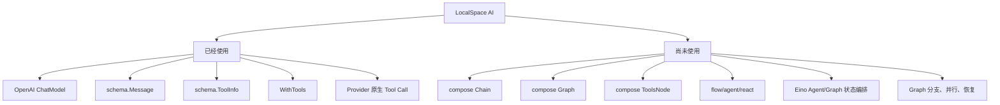

### 3.3 当前调用流程

#### AI 预览流程

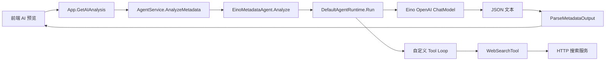

#### 批量导入流程

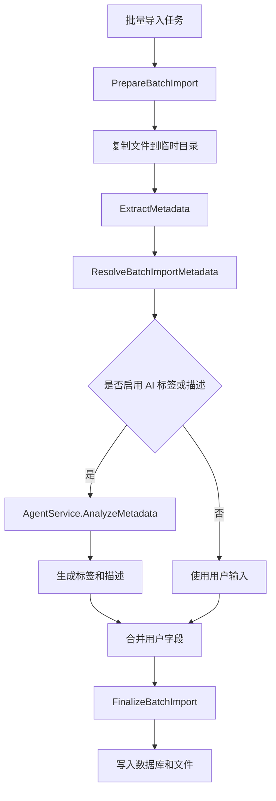

#### 当前 Agent 时序

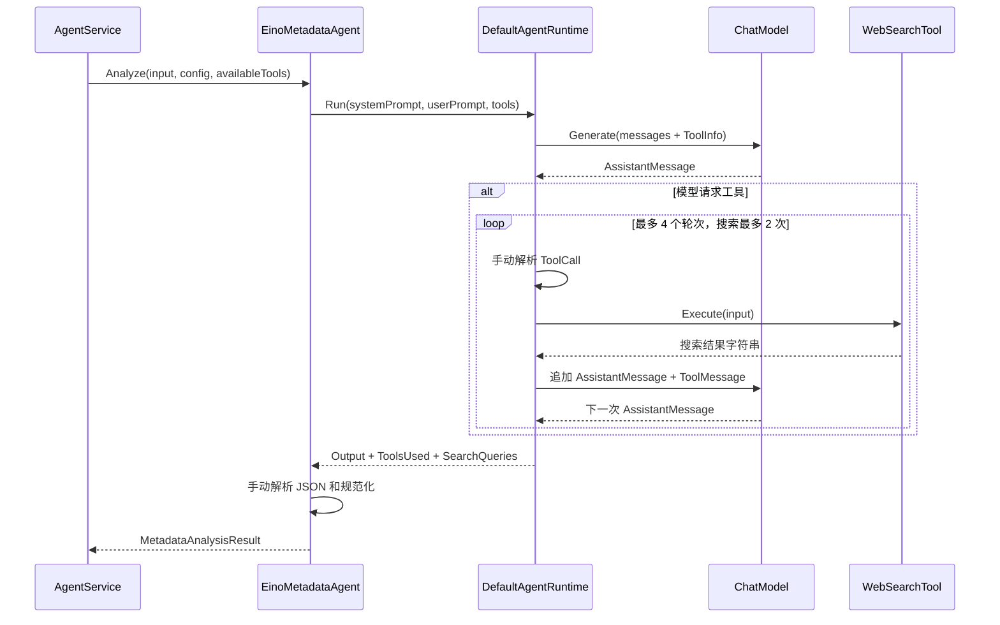

### 3.4 当前逻辑中的重要事实

#### 事实一：当前确实存在手写 loop

`app/agents/agent_runtime.go` 中自行维护：

- 工具名称到工具实例的映射；
- ToolCall 参数解析；
- 工具执行；
- AssistantMessage 和 ToolMessage 追加；
- 最大轮次；
- Web Search 最大调用次数；
- 工具使用记录；
- 搜索关键词记录。

这套逻辑可以工作，但它本质上是一个项目自研的简化 ReAct 执行器。

#### 事实二：旧 AI 路径和新 Agent 路径并存

`AIService.AnalyzeFile` 会依次执行：

```text
GenerateTags       -> 一次模型调用
GenerateDescription -> 一次模型调用
```

而新的 Agent 路径会先调用模型；当搜索工具被暴露时，当前 Prompt 会要求部分文件类型优先调用
`web_search`，随后再继续生成结果。这个行为与后续“本地证据优先、网络搜索按需使用”的目标并不一致。

当前 `AgentService` 通常已经存在，因此 `FileService` 的旧 AI fallback 实际上很少被触发。两条路径会导致配置、错误处理、Prompt、模型调用次数和结果质量不一致。

#### 事实三：当前 Agent 上下文不足

当前 `MetadataGenerationInput` 主要包含文件名、文件类型、用户输入和少量 Native Metadata。Agent 通常拿不到：

- 文档正文；
- 图片缩略图或 OCR 结果；
- 视频关键帧、字幕或媒体信息；
- 压缩包内部文件列表；
- LocalSpace 中的相似文件；
- 文件所在合集和附近文件上下文。

因此目前的分析主要是“根据文件名推断”，Web Search 也只是对文件名进行搜索。

另外，单文件预览、单文件实际导入和批量导入目前不是同一条路径：

- 单文件预览通过 `App.GetAIAnalysis` 调用 `AgentService`；
- 单文件 `ImportFile` 当前主要使用用户填写的标签和描述，不会自动执行 AI 分析；
- 批量导入通过 `ResolveBatchImportMetadata` 触发 AI，但目前主要只传入文件名和文件类型；
- `AgentService` 通常会把 Agent 失败转换为 fallback 结果，因此旧 `AIService` 并不一定会真正接管失败请求。

#### 事实四：单文件导入和批量导入行为不一致

批量导入会进入 `ResolveBatchImportMetadata`，而单文件 `ImportFile` 主要直接使用用户输入的标签和描述。单文件场景的 AI 更多是前端预览能力，不是导入流程中的统一分析节点。

#### 事实五：当前 trace 还没有成为产品能力

代码已经定义了：

- `ToolsAvailable`；
- `ToolsUsed`；
- `SearchQueries`；
- `FallbackReason`；
- `RawOutput`。

但是这些信息没有完整进入任务记录、数据库、前端进度或用户可见的分析详情。

## 4. 痛点

### 4.1 架构痛点

#### 痛点 A：编排职责集中在一个自研 Runtime

`DefaultAgentRuntime` 同时负责模型调用、工具调度、状态推进、轮次限制、错误处理和 trace。这会导致：

- 后续增加工具时不断修改 Runtime；
- 任务状态无法自然持久化；
- 不容易复用到其他 AI 能力；
- 测试大量依赖内部实现细节；
- 无法直接使用 Eino 已经提供的 React Agent 和 ToolsNode。

#### 痛点 B：业务层、Agent 层、工具层边界不够稳定

当前 `AgentService` 负责配置和策略，`EinoMetadataAgent` 负责 Prompt，`DefaultAgentRuntime` 又包含部分策略。随着功能增加，很容易出现：

```text
FileService 判断一次
AgentService 判断一次
Prompt 再要求一次
Runtime 又限制一次
```

最终导致“配置允许了，但 Agent 没调用”或“Trace 显示可用，但实际没有使用”的问题。

### 4.2 分析质量痛点

#### 痛点 C：没有先建立本地证据链

LocalSpace 是本地文件管理器，但当前 AI 主要依赖：

```text
文件名 + 文件类型 + 可选 Web Search
```

合理的证据优先级应当是：

```text
本地文件元数据
  > 文件内容或媒体信息
  > LocalSpace 本地库上下文
  > 外部网络搜索
```

#### 痛点 D：输出缺少可信度和证据

当前只输出标签和描述，无法回答：

- 这个标签来自哪里？
- 是文件内容推断，还是网络搜索结果？
- 模型有多大把握？
- 是否应该让用户确认？
- 哪些信息是事实，哪些是猜测？

#### 痛点 E：结构化输出依赖 Prompt 和后处理

当前通过 Prompt 要求模型返回 JSON，再用 `ParseMetadataOutput` 解析。缺少：

- 模型层面的结构化输出约束；
- Schema 校验失败后的定向重试；
- 字段级错误反馈；
- 低质量结果的质量门禁。

### 4.3 工程和产品痛点

#### 痛点 F：没有统一的任务状态

AI 分析基本是同步调用，缺少：

- 运行 ID；
- 节点状态；
- 当前步骤；
- 耗时；
- 可取消；
- 可重试；
- 失败后从中间节点恢复。

#### 痛点 G：读工具和写工具没有明确隔离

当前 Web Search 是只读工具，但未来如果加入“移动文件”“修改标签”“归入合集”，必须有明确的权限、预览和确认机制，不能让 Agent 直接操作数据库或文件系统。

## 5. 方案

### 5.1 总体设计原则

#### 原则一：先本地证据，后外部搜索

Web Search 只是补充工具，不应该作为所有文件类型的默认第一步。

#### 原则二：确定性逻辑使用 Chain，开放式决策使用 Agent

例如：

- 文件类型判断：Chain 或普通 Go 代码；
- 元数据提取：Chain；
- 是否需要 OCR 或搜索：React Agent；
- 标签去重和长度限制：Chain；
- 是否需要人工确认：Graph 分支。

#### 原则三：Graph 负责业务过程，Agent 负责局部决策

不把整个 LocalSpace 交给一个无限循环 Agent，而是在可控 Graph 中嵌入小范围 Agent 节点。

#### 原则四：分析和写入分离

AI 先生成建议和证据，用户确认后再执行写操作。

#### 原则五：每一步都可观测

所有模型调用、工具调用、分支、失败、重试和最终结果都应进入统一 trace。

### 5.2 目标架构脑图

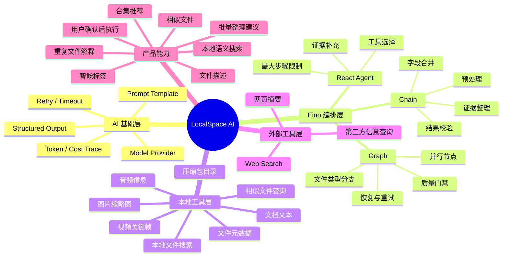

### 5.3 目标运行结构

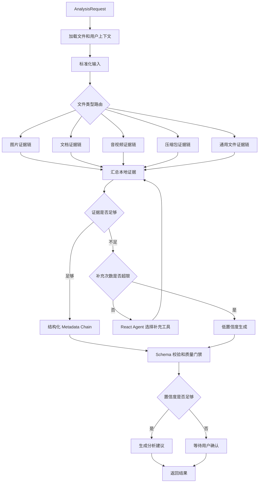

### 5.4 Chain、Agent、Graph 的职责边界

| 层 | 适合做什么 | 不适合做什么 |
| --- | --- | --- |
| Chain | 固定步骤、数据转换、并行处理、输出校验 | 自主决定调用哪些不确定工具 |
| React Agent | 根据上下文选择工具、补充证据、处理开放式问题 | 直接执行不可逆写操作 |
| Graph | 组织节点、分支、状态、重试、恢复、人工审核 | 承担所有具体业务细节 |
| Go Service | 权限、数据库、文件系统、事务 | 让模型直接决定系统行为 |

这里的“恢复”不是 Graph 自动提供的产品任务持久化能力。需要结合 Eino CheckPoint Store、序列化器、
RunID/CheckPointID 以及 LocalSpace 自己的任务记录，才能支持进程重启后的恢复。

## 6. 具体实现步骤

### Phase 0：统一 AI 合同和调用入口

**目标：** 在不大幅改变功能的情况下，先消除双路径和上下文缺失。

#### 步骤 0.1：定义统一分析输入

新增统一的分析请求结构，至少包含：

```go
type AnalysisRequest struct {
    FileID          uint
    FilePath        string
    FileName        string
    FileType        string
    FileSubType     string
    NativeMetadata  models.Metadata
    UserKeywords    string
    UserTags        []string
    UserDescription string
    CollectionID    *uint
}
```

`AnalysisRequest` 是后端完整请求，不等于直接发送给模型的 Prompt。建议再定义一个模型上下文投影：

```text
AnalysisRequest（后端内部）
  -> 权限校验、文件读取、数据库查询、Graph State
  -> ModelContext（允许发送给模型的字段）
```

`FileID`、`FilePath`、`CollectionID` 等内部字段可以保留在后端状态中，但默认不直接进入模型上下文。
绝对路径、API Key 和其他敏感信息必须在 Prompt 构造前过滤。

实现要求：

1. 单文件预览和批量导入都使用这个结构；
2. `ExtractMetadata` 的结果必须传入分析；
3. 不把 API Key、完整本地路径等敏感信息直接放入模型 Prompt；
4. 由 Context 控制超时和取消。

#### 步骤 0.2：统一分析服务

将 `AIService` 和 `AgentService` 的公共能力收敛到一个入口：

```text
Analyze(request) -> AnalysisResult
```

内部可以暂时保留旧实现作为 fallback，但业务层不再分别调用 `GenerateTags` 和 `GenerateDescription`。

#### 步骤 0.3：统一结果模型

结果至少包含：

```go
type AnalysisResult struct {
    Metadata  MetadataAnalysis
    Trace     AnalysisTrace
    Status    string
}
```

其中 `Trace` 记录：

- RunID；
- 使用的模型；
- 调用的工具；
- 每个工具耗时；
- 失败和 fallback 原因；
- 最终置信度；
- 使用的证据来源。

#### Phase 0 验收标准

- 单文件预览和批量导入调用同一个分析入口；
- 一次分析同时返回标签和描述；
- 用户输入优先级明确；
- AI 失败不会阻塞文件导入；
- 可以区分“未启用 AI”“Agent 未启用”“Agent 失败”。

### Phase 1：用 Eino React Agent 替换手写 Tool Loop

**目标：** 让 Eino 接管 Agent 的工具循环和状态推进。

#### 步骤 1.1：改造工具接口

当前自定义工具接口是：

```go
type Tool interface {
    Name() string
    Description() string
    Execute(ctx context.Context, input string) (string, error)
}
```

建议保留业务层工具接口，但新增 Eino 适配层：

```text
LocalSpace Tool
      ↓ adapter
Eino BaseTool / InvokableTool
      ↓
compose.ToolsNode
```

这样业务工具不直接依赖 Eino，同时可以使用 Eino 的标准工具执行机制。

#### 步骤 1.2：使用类型化工具参数

`web_search` 不再只接收一个任意字符串，而是定义明确参数：

```json
{
  "query": "string",
  "limit": "number"
}
```

工具内部负责：

1. 参数校验；
2. 查询长度限制；
3. 最大结果数限制；
4. 超时和取消；
5. 结果截断；
6. 结构化返回。

#### 步骤 1.3：接入 React Agent

使用 Eino v0.9.12 中的 `flow/agent/react`：

```text
ChatModel
  + ToolsConfig
  + compose.ToolsNode
  + MaxStep
  + Tool Middleware
```

当前 `maxRounds` 和 `maxWebSearchCalls` 的行为不能简单视为同一个限制，需要分别迁移到：

- `MaxStep`：控制 Agent 整体最大执行步骤。它与当前只统计模型/工具循环的 `maxRounds` 不是严格一一对应，必须通过测试校准；
- 工具 middleware：记录工具调用、耗时和错误；
- LocalSpace 自己的 Tool Policy：控制每种工具的最大调用次数，例如 `web_search` 最多两次；
- Context：控制整体超时。

其中 Tool Policy 是 LocalSpace 的业务策略，不能假设 Eino 会自动替代当前的按工具计数逻辑。

#### 步骤 1.4：保留当前业务降级策略

React Agent 失败时，`AgentService` 仍然返回安全 fallback：

```text
Agent 失败
  -> 记录 FallbackReason
  -> 使用本地文件名和类型生成最小结果
  -> 不阻塞导入
```

#### Phase 1 验收标准

- `DefaultAgentRuntime` 不再维护核心工具循环；
- Agent 可以调用 `web_search` 并拿到 ToolMessage；
- 工具 trace 和当前结果兼容；
- 工具调用次数仍受限制；
- 工具错误不会造成无限重试；
- 现有 Agent 和 Tool 测试全部保留并通过。

### Phase 2：增加本地证据工具

**目标：** 让 Agent 首先理解本地文件，而不是依赖文件名和网络搜索。

推荐按以下顺序实现。

#### 步骤 2.1：本地基础元数据工具

将现有 `ExtractMetadata` 能力包装为分析节点或工具：

- 文件大小；
- 图片尺寸；
- 视频时长和编码；
- 音频编码和时长；
- 文档页数、作者、标题；
- 文件扩展名和文件子类型。

这部分是确定性逻辑，优先做成 Chain 节点，不必交给 Agent 决定。

#### 步骤 2.2：文档内容工具

增加 `extract_document_text`：

- 只读取明确允许的文件类型；
- 限制最大字数；
- 只返回摘要片段，不把整个文档塞进 Prompt；
- 返回页码或段落来源；
- 对敏感目录提供禁用选项。

#### 步骤 2.3：媒体证据工具

增加：

- `get_image_thumbnail`；
- `extract_video_keyframes`；
- `get_audio_metadata`；
- 后续可选的字幕和语音转写。

图片和视频不能只通过 Web Search 判断内容，必须允许模型读取视觉证据或结构化媒体信息。

#### 步骤 2.4：LocalSpace 本地库工具

增加：

- `search_local_files`；
- `find_similar_files`；
- `list_collections`；
- `get_collection_context`。

这些能力可以支持：

- 合集推荐；
- 相似文件发现；
- 标签复用；
- 重复文件解释；
- 本地知识问答。

### Phase 3：构建文件分析 Graph

**目标：** 将文件分析从单次 Prompt 调用升级成可追踪的工作流。

#### 步骤 3.1：定义 Graph State

建议状态包含：

```go
type AnalysisState struct {
    Request       AnalysisRequest
    Evidence      []EvidenceItem
    Draft         *MetadataAnalysis
    ToolTrace     []ToolTraceItem
    Confidence    float64
    NeedReview    bool
    Errors        []string
    CurrentStage  string
    EnrichCount   int
    RunID         string
    CheckPointID  string
}
```

`evidence_quality -> enrich_agent -> merge_evidence` 必须是有界循环。建议默认最多补充 1～2 次；
超过上限后仍然证据不足，则继续生成但降低置信度并进入人工确认，不能再次回到 Agent 节点。

#### 步骤 3.2：实现基础节点

节点职责建议如下：

| 节点 | 类型 | 职责 |
| --- | --- | --- |
| `load_context` | Go Lambda | 加载请求、配置、用户字段 |
| `extract_native_metadata` | Go Lambda | 提取本地结构化元数据 |
| `extract_content` | Chain | 提取文档、媒体、图片证据 |
| `merge_evidence` | Go Lambda | 汇总证据并去重 |
| `evidence_quality` | Branch | 判断证据是否足够 |
| `enrich_agent` | React Agent | 选择额外工具 |
| `generate_metadata` | Chain + Model | 生成结构化结果 |
| `validate_metadata` | Go Lambda | Schema、长度、标签质量校验 |
| `review_gate` | Branch | 判断自动保存或人工确认 |
| `persist_suggestion` | Go Service | 保存建议和 trace |

如果进入人工确认，Graph 不应直接结束。应保存当前状态和 checkpoint，并向前端返回 `RunID`；用户确认后，
通过恢复接口继续执行后续节点。人工审核节点需要使用幂等设计，避免恢复或重试时重复写入。

#### 步骤 3.3：实现文件类型分支

```text
image      -> thumbnail / OCR / visual model
document   -> text extraction / title / author / keywords
video      -> ffprobe / keyframes / subtitles
music      -> media metadata / cover / transcript
archive    -> archive entries / file type statistics
installer  -> version / platform / signature metadata
generic    -> filename / extension / local context
```

#### 步骤 3.4：实现并行证据采集

例如视频文件可以并行执行：

```text
ffprobe ───────┐
thumbnail ─────┼──> merge_evidence
subtitle ──────┤
local_search ──┘
```

只有在需要外部信息时，才进入 React Agent 或 Web Search 分支。

#### Phase 3 验收标准

- 每个分析阶段有明确名称和状态；
- 文件类型可以走不同分支；
- 可记录每个证据来源；
- Agent 只出现在需要自主选择工具的节点；
- 结构化输出失败可以定向重试；
- Graph 失败时可以定位到具体节点。

#### Phase 3 当前实施结果

本阶段已完成第一版可运行 Graph，代码位于 `app/agents/metadata_graph.go`，并已接入 `AgentService`。

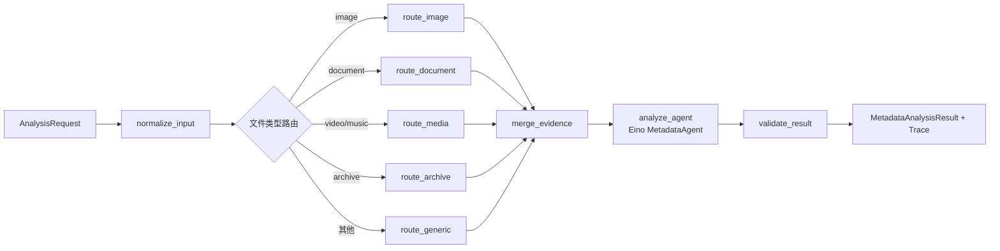

当前实现步骤：

1. `normalize_input` 统一文件类型；当调用方没有传入类型时，根据扩展名进行基础推断。
2. Graph 分支将 image、document、media、archive 和 generic 分开，并在 `merge_evidence` 汇聚到同一个后续流程。
3. `merge_evidence` 复用 Phase 2 已采集的本地证据，不在 Graph 内重复读取文件。
4. `analyze_agent` 调用现有 Eino Agent；Agent 仍负责工具选择和结构化 JSON 生成，Graph 不重新实现 tool loop。
5. `validate_result` 校验结果非空、清理标签和描述，并把 `CurrentStage`、`StageHistory`、`Errors` 写入 trace。
6. `AgentService` 默认走 Graph；Graph 构建或执行失败时沿用原有 fallback，不能阻塞文件导入。

本阶段暂不实现图片视觉理解、视频关键帧和本地文件搜索；这些能力将在 Graph 路由节点稳定后作为具体证据节点接入。当前各媒体路由已经预留，因此后续增加能力时不需要改变 AgentService 的入口契约。

### Phase 4：结构化结果、质量门禁和用户确认

**目标：** 防止模型猜测结果直接污染文件库。

建议将输出从当前的：

```json
{
  "tags": [],
  "description": ""
}
```

扩展为：

```json
{
  "title": "",
  "tags": [],
  "description": "",
  "keywords": [],
  "suggestedCollection": "",
  "confidence": 0.0,
  "evidence": [],
  "needsReview": false
}
```

质量门禁示例：

```text
置信度 >= 0.85 且证据充分 -> 可自动应用
0.60 <= 置信度 < 0.85 -> 展示建议，用户确认
置信度 < 0.60 -> 不自动写入，只保留分析结果
结构化校验失败 -> 定向重试一次
仍失败 -> fallback
```

置信度不应完全由模型自由填写。建议综合证据来源、证据数量、规则校验结果和模型输出计算，模型给出的
置信度只能作为其中一个输入。

#### Phase 4 当前实施结果

已在 Phase 3 Graph 的结构化校验后增加 `quality_gate` 和质量分支：

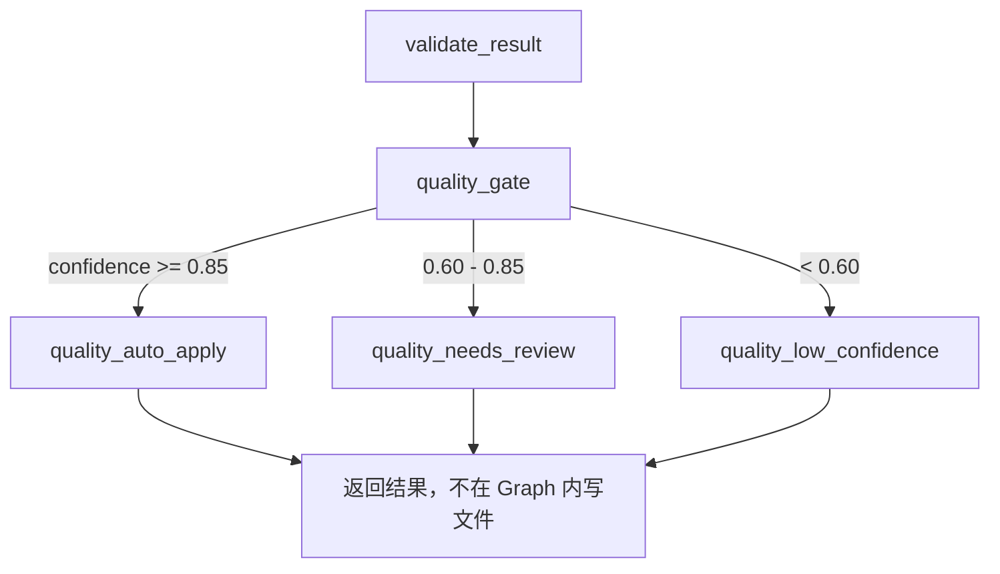

具体实现步骤：

1. 质量门禁使用本地证据数量、文件元数据证据、用户上下文、标签完整度和描述完整度计算置信度，不完全采信模型自报值。
2. 结果 trace 增加 `Confidence`、`NeedsReview` 和 `QualityStatus`，并保留 Graph 阶段历史。
3. `GetAIAnalysis` 将质量状态返回给前端，用户可以看到建议是否需要确认。
4. 批量导入遇到 `needs_review` 或 `low_confidence` 时不自动写入 AI 建议，只保留用户已填写的标签和描述。
5. Graph 只生成建议和状态，不执行文件移动、数据库写入等不可逆操作；后续确认接口再负责显式应用。

### Phase 5 当前实施结果（第一批）

在本地搜索能力暂缓的前提下，先完成标签复用的结果契约和 Graph 节点：

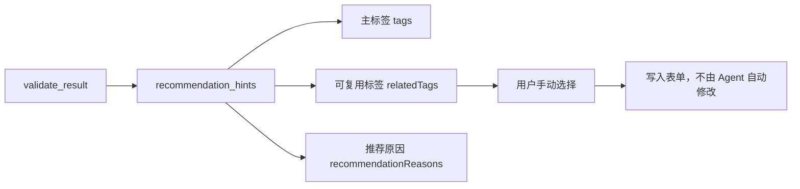

当前实现步骤：

1. 从用户已有标签和关键词中提取候选标签，去重后最多返回 5 个。
2. 已经存在于 AI 主标签中的候选不会重复推荐。
3. `relatedTags` 与 `tags` 分离，前端可以单独展示并由用户点击应用。
4. `suggestedCollection` 字段已预留，但在没有本地合集上下文时保持为空，不凭空创建合集建议。
5. 合集推荐、相似文件、本地文件问答仍等待后续 `search_local_files` 和 `find_similar_files` 能力，不在本批次提前实现。

### Phase 6 当前实施结果（安全写入边界）

已增加显式确认写入接口，但没有向 Agent 暴露任何写工具：

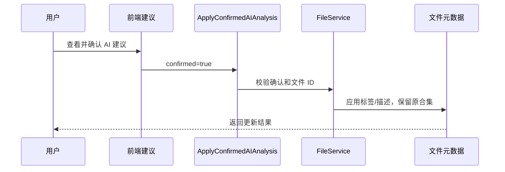

实现约束：

1. `confirmed=false` 时服务端直接拒绝，不能依赖前端自律。
2. AI 建议应用只修改标签和描述，不会改变文件路径或合集归属。
3. 重复确认是幂等的，重复写入相同元数据不会触发文件移动。
4. Agent 仍然只有只读分析工具，不能直接调用该写入接口。

## 7. 功能拓展路线

### 7.1 智能导入

导入文件时自动生成：

- 标题；
- 标签；
- 描述；
- 关键词；
- 文件类型修正建议；
- 合集建议。

### 7.2 智能合集

根据文件的：

- 标签；
- 描述；
- 类型；
- 本地相似文件；
- 用户历史归类行为；

生成合集推荐，但默认只推荐，不直接移动文件。

### 7.3 重复和相似文件分析

当前已经有 checksum 和重复文件能力，后续可以补充：

- 同 checksum：确定重复；
- 不同 checksum、相似文件名：可能是不同版本；
- 相似图片或视频：内容近似；
- 相似文档：版本或副本关系。

AI 负责解释和推荐，checksum、文件大小和路径关系仍由确定性代码负责。

### 7.4 本地文件问答

可以构建只读的 LocalSpace Assistant：

```text
用户问题
  -> 本地文件搜索
  -> 相关文件和元数据
  -> 必要时读取内容
  -> 生成带文件引用的回答
```

例如：

- “找出所有和 Go 开发相关的 PDF”；
- “哪些视频可能是同一部电影的不同版本”；
- “上个月导入的安装包有哪些”；
- “哪些文件还没有描述”。

### 7.5 操作型 Agent

最后再开放写操作：

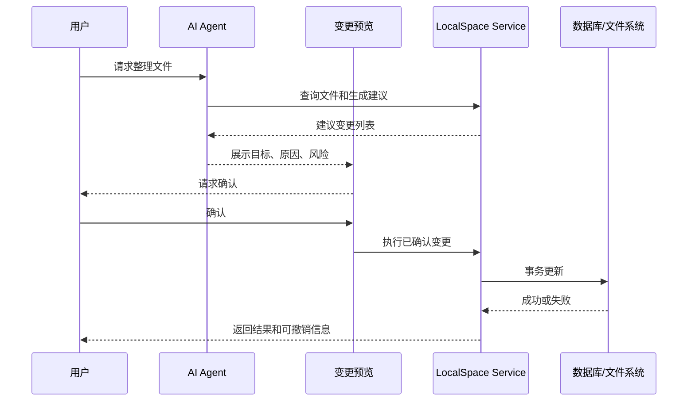

必须满足：

- 所有写操作有用户确认；
- 文件移动和数据库更新尽量使用事务或补偿机制；
- 记录变更前后状态；
- 支持撤销；
- Agent 不直接访问数据库连接和文件系统 API。

## 8. 工程实现建议

### 8.1 建议的目录结构

```text
app/ai/
  model_factory.go        # 模型创建和配置
  analysis_service.go     # 统一分析入口
  analysis_types.go       # 请求、结果、证据、trace
  prompts.go              # Prompt 模板
  structured_output.go    # 结构化输出和校验

app/ai/tools/
  adapter.go              # LocalSpace Tool -> Eino Tool
  file_metadata.go
  document_text.go
  media_evidence.go
  local_search.go
  web_search.go

app/ai/workflows/
  metadata_graph.go       # 文件分析 Graph
  metadata_chain.go       # 确定性 Metadata Chain
  enrichment_agent.go     # React Agent

app/ai/trace/
  recorder.go
  event.go
```

现有 `app/agents` 和 `app/tools` 可以逐步迁移，不需要一次性重命名全部代码。

### 8.2 测试策略

#### 单元测试

- 工具参数校验；
- 文件证据截断；
- Prompt 输入构造；
- 输出 Schema 校验；
- 标签规范化；
- 置信度门禁；
- fallback 行为。

#### Agent 测试

- 无工具时直接输出；
- 需要工具时能调用正确工具；
- 未知工具安全失败；
- 最大步骤生效；
- 工具错误不会无限重试；
- trace 与实际调用一致。

#### Graph 测试

- 各文件类型路由正确；
- 并行节点结果正确合并；
- 证据不足进入 Agent；
- 低置信度进入人工确认；
- 节点失败可以定位；
- 重试不会重复执行有副作用的写操作。

#### 集成测试

- 单文件导入；
- 批量导入；
- AI 关闭；
- Agent 关闭；
- Web Search 关闭；
- 搜索服务超时；
- 模型返回非法 JSON；
- 模型调用失败；
- 用户字段覆盖 AI 建议。

## 9. 风险控制

### 隐私风险

- 默认不上传完整本地文件；
- 文档内容只上传受限片段；
- Web Search 查询前移除本地绝对路径；
- 提供“禁止外部搜索”配置；
- 明确哪些工具会访问网络。

### 成本和延迟风险

- 先执行本地确定性节点；
- 只有证据不足时才使用 Agent；
- Agent 设置最大步骤；
- 工具设置独立超时；
- 对相同 checksum 或内容 hash 做缓存；
- 对批量导入设置并发限制。

### 错误写入风险

- 分析和写入分离；
- 低置信度不自动落库；
- 写操作必须显式确认；
- 所有变更保留前后值；
- 对文件移动提供补偿和撤销。

## 10. 推荐实施顺序

不要一开始就同时开发多 Agent、语义搜索和自动整理。推荐顺序是：

```text
Phase 0 统一 AI 合同和入口
   ↓
Phase 1 用 Eino React Agent 替换手写 loop
   ↓
Phase 2 增加本地证据工具
   ↓
Phase 3 用 Eino Graph 组织文件分析流程
   ↓
Phase 4 增加结构化质量门禁和用户确认
   ↓
Phase 5 扩展合集推荐、相似文件和本地问答
   ↓
Phase 6 最后开放带确认的写操作 Agent
```

其中最有价值的第一步不是立即增加更多 Agent，而是完成下面三个基础修正：

1. 统一 `AIService` 和 `AgentService` 的入口；
2. 用 Eino React Agent 接管当前手写 tool loop；
3. 把真正的本地文件证据传给分析流程。

完成这三步后，LocalSpace 的 AI 才会从“根据文件名生成标签”逐步变成“基于本地证据、可解释、可控制的文件分析系统”。

## 11. 最终验收标准

整体架构完成后，应满足以下条件：

- Eino 负责模型、工具节点和 Agent 编排；
- LocalSpace 业务层负责权限、文件系统、数据库和事务；
- Chain、React Agent、Graph 各自职责清晰；
- 单文件和批量导入使用同一套分析能力；
- Agent 能使用本地证据工具；
- Web Search 只在必要时使用；
- 所有结果带有置信度和证据来源；
- 每次分析都有可追踪的运行记录；
- AI 失败不会阻塞导入；
- 任何写操作都需要用户确认；
- Graph 节点失败、重试和恢复行为可测试。
